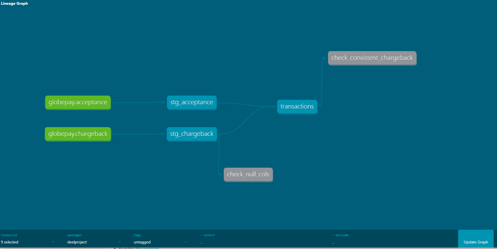
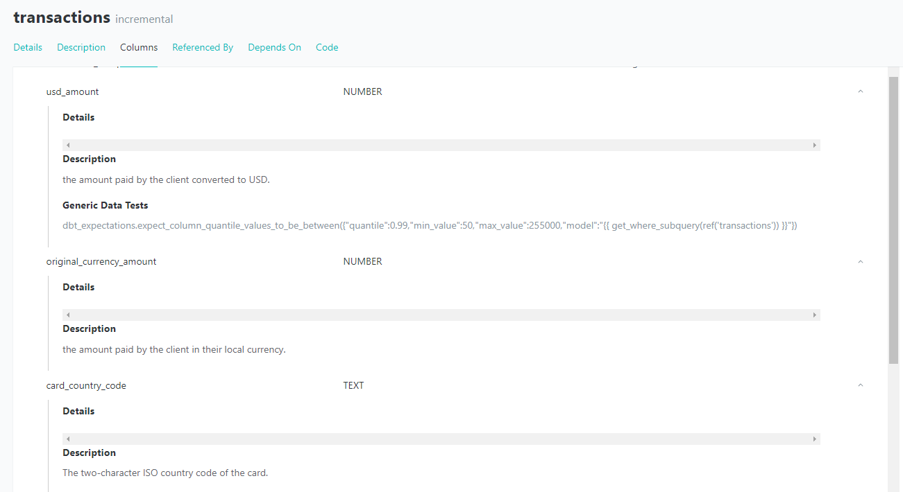

# Assignment

## Part 1  
### 1. Preliminary data exploration

### 2. Summary of the model architecture

**Overview**

The data model architecture is designed to efficiently process and transform raw data into an analytics-ready format using dbt. The underlying database platform is Snowflake.

**Architecture Components**

The architecture consists of three main layers:
- Raw Data Layer
- Staging Layer
- Core Layer 

**Raw Data Layer**

Source Tables
- GLOBEPAY.RAW.ACCEPTANCE
- GLOBEPAY.RAW.CHARGEBACK

These tables contain the raw data ingested from Globepay API. No transformations are applied at this stage, preserving the original format and structure of the incoming data.

**Staging Layer**

Staging Views
- GLOBEPAY.DEV.STG_ACCEPTANCE
- GLOBEPAY.DEV.STG_CHARGEBACK

In the staging layer, the first set of transformations is applied to clean and prepare the data for further processing. Key transformations include:

- Renaming Columns: New, more descriptive column names are assigned to improve readability.
- Standardization: Data values are standardized. For example, fields expected to hold boolean values are converted to a boolean format.
- New Calculations: A new column currency_rate is introduced to provide better insight into currency conversions and facilitate downstream calculations.

**Core Layer**

Final Model
- GLOBEPAY.DEV.TRANSACTIONS

At this stage, data from the two staging views (stg_accepetance and stg_chargeback) are combined into a single table suitable for analytics. Additional transformations include:

- Data Integration: Combining relevant fields from the acceptance and chargeback datasets to create a comprehensive view.
- New Calculations: Introducing a usd_amount column, which standardizes transaction amounts to USD, enabling consistent metrics and comparisons across different currencies.


### 3. Lineage graphs

Below the lineage graph of the entire model. On green it's represented the raw sources. The blue squares represent the 3 models and the gray represent the generic tests.



### 4. Tips around macros, data validation, and documentation

**Macros**
The macro not_null_cols was created for helping to evaluate nulls in columns and it was added to make sure stg_chargeback is fully loaded. There is also the non_negative_value macro, that given a model and a column can evaluate whether it has a value lower than zero. This macro ended up not being used. Instead, it was decided to use a data validation test for that purpose. The macro can still be useful in case the model grows.

**Data validation**
To ensure data quality and integrity, various data validation tests have been implemented across different models in the dbt project. These validations help in maintaining the accuracy, consistency, and reliability of the data. Some examples of the tests are:

- **usd_amount:**
Quantile Range Check: 99% of values must be between $50 and $255,000.

- **external_ref:**
Unique, not null and Referential Integrity.

- **payment_platform:**
Accepted Values: Only 'GLOBALPAY'.

- **amount:**
Minimum Value: At least 0.01 and not null

**Documentation** is key to maintain a clear understanding of the models and how to use it, specially for analytics. Below a image displaying some of the documentation served by dbt




## Part 2

```sql
--1. What is the acceptance rate over time? -- LATER MAYBE INCLUDE NO CHARGEBACK FILTER
SELECT 
    DATE_TRUNC('month', TRANSACTION_TIMESTAMP_UTC) AS month,
    COUNT_IF(transaction_accepted)/COUNT(*)
FROM 
     GLOBEPAY.DEV.TRANSACTIONS
GROUP BY 
    month
ORDER BY 
    month;
    
--2. List the countries where the amount of declined transactions went over $25M
SELECT 
CARD_COUNTRY_CODE, SUM(usd_amount) AS usd_amount_per_country
FROM 
     GLOBEPAY.DEV.TRANSACTIONS
WHERE NOT(transaction_accepted)  
GROUP BY 
    CARD_COUNTRY_CODE
HAVING usd_amount_per_country>25000000
ORDER BY 
    usd_amount_per_country desc;

-- 3. Which transactions are missing chargeback data?

-- 3.1 Are all transactions from GLOBEPAY.RAW.ACCEPTANCE on GLOBEPAY.RAW.CHARGEBACK?
-- ANSWER: YES. In dbt we are testing it but we can also double-check it with the following
SELECT external_ref FROM GLOBEPAY.RAW.ACCEPTANCE 
EXCEPT
SELECT external_ref FROM GLOBEPAY.RAW.CHARGEBACK 
```